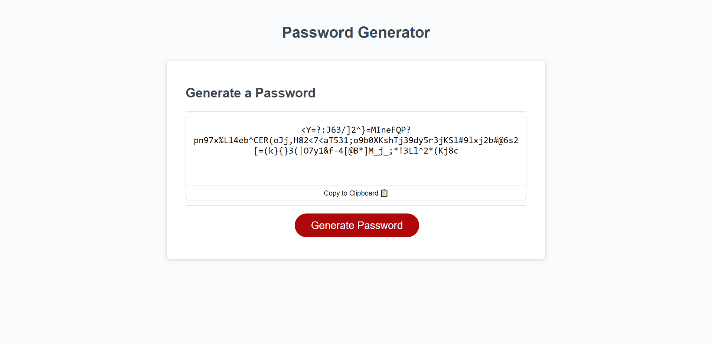

# Random Password Generator

## Deployed Site: [https://kkolyvek.github.io/password-generator/](https://kkolyvek.github.io/password-generator/)

## Brief Description:

This site generates a random password based on the user's specifications. Additionally, the user can copy the password to clipboard if desired.

## How it Works:

Once the 'generate password' button is clicked, the user is prompted to answer several questions regarding password composition:

1. Length of password (between 8 and 128 characters).
2. Whether to include lowercase letters.
3. Whether to include uppercase letters.
4. Whether to include numbers.
5. Whether to include special characters.

Once complete (and at least one character type is selected), the algorithm will generate a random password and post it to the text area. Each character type has an equal chance of appearing per character rather than proportionally (i.e. even though there are 26 letters and only 10 numbers, each character has an equal chance of being a letter or a number).

## Site Preview:

